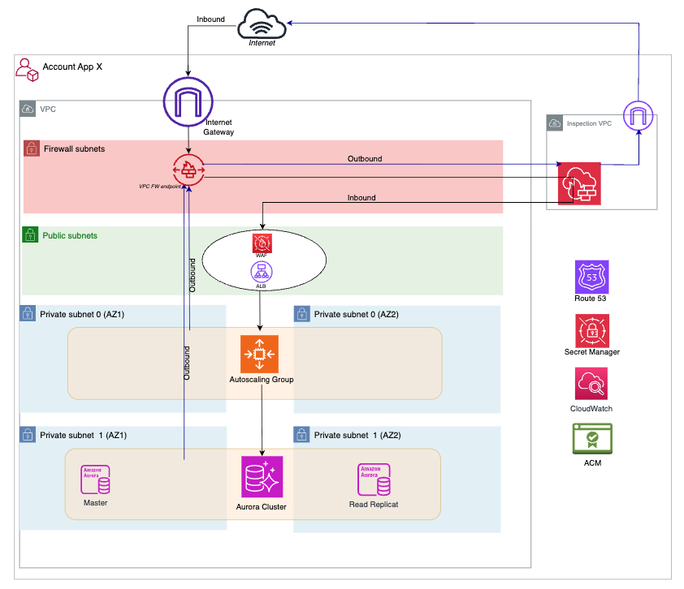

# Terraform Blueprint: Basic IaaS Standalone

[](https://www.terraform.io/)
[](https://aws.amazon.com/)
[](#shared-terraform-modules-aws)
[](LICENSE)

> Production-ready Terraform blueprint for deploying a secure 3-tier application foundation on AWS with EC2 Auto Scaling, Aurora PostgreSQL, centralized modules, CI/CD, and CloudWatch monitoring.

---

## Table of Contents

- [Overview](#-overview)
- [Architecture](#-architecture)
- [Features](#-features)
- [Prerequisites](#-prerequisites)
- [Quick Start](#-quick-start)
- [Multi-Environment Setup](#-multi-environment-setup)
- [Repository Structure](#repository-structure)
- [Shared Terraform Modules](#shared-terraform-modules-aws)
- [Configuration Guide](#configuration-guide)
- [CI/CD Workflow](#-cicd-workflow)
- [Common Operations](#common-operations)
- [Monitoring And Operations](#-monitoring-and-operations)
- [Troubleshooting](#troubleshooting)
- [Contributing](#-contributing)
- [License](#license)

---

## Overview

The Basic IaaS Standalone blueprint is a production-ready infrastructure-as-code template for deploying secure, scalable, and highly available 3-tier web applications on AWS.

This repository is a consumer repository. Reusable module implementation lives in `terraform-modules-aws`; this blueprint wires those modules together for a specific architecture.

### Key Features

- **Zero Manual Setup** - Terraform delivery is automated through GitHub Actions
- **Production-Ready** - Designed around AWS Well-Architected principles for a standard 3-tier pattern
- **Multi-Environment** - Supports `dev` and `prod` environment folders
- **Secure by Default** - KMS encryption, IAM instance profile, and security groups
- **Monitoring Built-in** - CloudWatch dashboard, alarms, and SNS notifications
- **Centralized Modules** - Consumes released modules from `terraform-modules-aws`

---

## Architecture



### High-Level Flow

1. Users access the application through a custom DNS name managed in Route 53.
2. ACM provides the TLS certificate used by the Application Load Balancer.
3. The ALB routes HTTPS traffic to EC2 instances in private subnets.
4. An Auto Scaling Group manages the application instances across multiple Availability Zones.
5. Aurora PostgreSQL provides the relational database layer.
6. Secrets Manager stores database credentials.
7. KMS encrypts EBS, RDS, and secret data.
8. CloudWatch dashboards and alarms provide operational visibility.

### Infrastructure Components

| Layer | AWS Service | Purpose |
| --- | --- | --- |
| Network | Existing VPC and subnets | Public subnets for ALB, private subnets for application and database resources |
| Load balancing | Application Load Balancer | HTTPS entry point and health checking |
| Compute | EC2 Auto Scaling Group | Application servers with self-healing and scaling |
| Identity | IAM role and instance profile | EC2 permissions for SSM and CloudWatch |
| Database | Aurora PostgreSQL | Highly available relational database |
| Secrets | AWS Secrets Manager | Database credential storage |
| Encryption | AWS KMS | Customer-managed keys for infrastructure data |
| Observability | CloudWatch and SNS | Dashboards, alarms, and email notifications |

---

## Features

### Infrastructure

- Existing VPC integration with public and private subnets across multiple Availability Zones
- HTTPS entry point through an Application Load Balancer
- SSL/TLS certificates with automated DNS validation through Route 53
- EC2 Auto Scaling Group with launch template and health checks
- IAM instance profile for EC2 access to SSM and CloudWatch
- Aurora PostgreSQL cluster with automated backups
- Three KMS keys for EBS, RDS, and Secrets Manager encryption
- Secrets Manager integration for database credentials
- SSM Parameter Store entries for application and database configuration

### Operations

- GitHub Actions workflows for Terraform plan, apply, destroy, and formatting checks
- Remote Terraform state managed through the centralized backend module
- CloudWatch dashboard for ALB, EC2/ASG, and Aurora metrics
- CloudWatch alarms with SNS email notifications
- Module consumption from the central `terraform-modules-aws` repository using pinned Git tags

---

## Prerequisites

### Local Tools

Terraform operations are executed by GitHub Actions. Local tools are only required for repository changes and optional validation.

| Tool | Required For | Notes |
| --- | --- | --- |
| Git >= 2.0 | Standard workflow | Clone the repository, create branches, commit, and push changes |
| Terraform >= 1.7 | Optional local validation | Useful for `terraform fmt` or local reviews; plan/apply runs in GitHub Actions |

### Required AWS And Platform Inputs

- AWS account with permissions for EC2, ALB, RDS, Route 53, ACM, KMS, IAM, CloudWatch, SNS, SSM, and Secrets Manager
- Existing VPC with public and private subnets
- Route 53 hosted zone for the application domain
- Golden AMI or approved AMI ID for EC2 instances
- GitHub repository with Actions enabled
- GitHub OIDC role configured for AWS authentication

---

## Quick Start

Use this repository by configuring an environment folder, then pushing the change so GitHub Actions can run the Terraform workflows.

### 1. Clone And Configure

```bash
# Clone repository
git clone <repository-url>
cd terraform-blueprint-basic-iaas

# Configure environment
cd infrastructure/environments/dev
cp terraform.tfvars.example terraform.tfvars
vim terraform.tfvars
```

### 2. Essential Configuration

Edit `infrastructure/environments/dev/terraform.tfvars`:

```hcl
# Project
project_name = "basic-iaas"
environment  = "dev"
region       = "eu-west-1"

# Networking (your existing VPC)
vpc_id             = "vpc-xxxxx"
public_subnet_ids  = ["subnet-xxxxx", "subnet-yyyyy"]
private_subnet_ids = ["subnet-zzzzz", "subnet-aaaaa"]

# DNS (your Route 53 hosted zone)
domain_name = "app.your-domain.com"
zone_name   = "your-domain.com"
zone_id     = "Z0XXXXXXXXXXXXX"

# Monitoring
alert_email = "your-email@company.com"

# Compute
ami_id        = "ami-xxxxx"
instance_type = "t3.micro"

# Database
db_name     = "appdb"
db_username = "admin"
```

### 3. Review The Environment Files

The environment folder contains the Terraform entry point for this deployment:

```text
main.tf
variables.tf
terraform.tfvars
backend.tf
monitoring.tf
outputs.tf
```

For production, make the equivalent changes under `infrastructure/environments/prod`.

### 4. Deploy Via GitHub Actions

```bash
# Commit configuration
git add infrastructure/environments/dev/terraform.tfvars
git commit -m "feat: configure dev environment"

# Push to trigger deployment workflow
git push origin <branch-name>
```

GitHub Actions will:

1. run the `terraform-plan` workflow to show the proposed changes
2. display the `Plan Run ID` in the workflow summary
3. wait for review and approval
4. run the `terraform-apply` workflow when manually triggered by an authorized user

To apply the reviewed plan, open the completed `terraform-plan` run in GitHub Actions and copy the `Plan Run ID` from the workflow summary. Then open `Terraform Apply`, click `Run workflow`, select the same environment, paste the `Plan Run ID`, and type `APPLY` in the confirmation field.

### 5. Confirm SNS Email

Check your email for the AWS SNS subscription confirmation and click `Confirm subscription`.

### 6. Access Application

Your application will be available at:

```text
https://app.your-domain.com
```

---

## Multi-Environment Setup

Create additional environments by copying the `dev` folder:

```bash
cp -r infrastructure/environments/dev infrastructure/environments/prod
vim infrastructure/environments/prod/terraform.tfvars
# Update values for production
```

---

## Repository Structure

```text
infrastructure/
  bootstrap/backend/        Backend bootstrap configuration for remote state resources
  environments/dev/         Development environment configuration
  environments/prod/        Production environment configuration
  monitoring/               Dashboard templates shared by environments
docs/
  images/                   Architecture diagrams
.github/workflows/          Terraform plan, apply, destroy, fmt, and quality workflows
README.MD                   Repository entry point
```

There are no local Terraform modules in this blueprint. Modules are consumed from the central `terraform-modules-aws` repository through pinned Git tags.

---

## Shared Terraform Modules

This blueprint consumes released modules from:

```text
git::ssh://git@github.com/your-org/terraform-modules-aws.git//modules/<module>?ref=v1.0.0
```

| Module | Used For |
| --- | --- |
| `backend` | S3 and KMS resources for Terraform remote state bootstrap |
| `security-groups` | ALB, application, and database security group rules |
| `acm-alb` | TLS certificate and DNS validation for ALB traffic |
| `alb` | Application Load Balancer, listener, target group, and ALB alarms |
| `kms` | Keys for EBS, RDS, and Secrets Manager encryption |
| `iam` | EC2 IAM role and instance profile for SSM and CloudWatch |
| `asg` | Launch template and Auto Scaling Group |
| `secrets-manager` | Generated database password storage |
| `aurora` | Aurora PostgreSQL cluster and instances |
| `ssm-parameters` | Application and database configuration parameters |
| `monitoring` | CloudWatch dashboard, alarms, SNS topic, and subscriptions |

To upgrade a module, change only the `ref` value in the consuming Terraform source after validating the new version.

---

## Configuration Guide

### Networking

Use existing network resources. Public subnets are used by the ALB; private subnets are used by EC2 and database resources.

```hcl
vpc_id             = "vpc-xxxxxxxx"
public_subnet_ids  = ["subnet-public-a", "subnet-public-b"]
private_subnet_ids = ["subnet-private-a", "subnet-private-b"]
```

### Compute

The ASG module uses the AMI and instance type from the environment configuration.

```hcl
ami_id               = "ami-xxxxxxxx"
instance_type        = "t3.micro"
asg_min_size         = 2
asg_max_size         = 3
asg_desired_capacity = 2
```

### IAM

The blueprint creates an EC2 IAM role and instance profile through the central `iam` module. It is used by the ASG launch template so instances can publish CloudWatch metrics/logs and use SSM Session Manager.

The ECS blueprint does not consume this IAM module; ECS task roles are created inside the central `ecs` module.

### Database

Aurora PostgreSQL is configured through environment variables and receives its password from Secrets Manager.

```hcl
db_name            = "appdb"
db_username = "admin"
```

### DNS And TLS

The ACM module validates the certificate through Route 53. Make sure the hosted zone values match the domain.

```hcl
domain_name = "app.example.com"
zone_name   = "example.com"
zone_id     = "Z0000000000000"
```

---

## CI/CD Workflow

| Workflow | Trigger | Purpose |
| --- | --- | --- |
| `terraform-plan` | Push/PR to `dev` or `main` | Preview infrastructure changes |
| `terraform-apply` | Manual approval after plan | Deploy reviewed infrastructure changes |
| `terraform-destroy` | Manual trigger | Destroy all resources |
| `terraform-fmt` | Manual trigger | Auto-format Terraform code |
| `sonarqube-quality-scan` | Push/PR to `dev` or `main` | Code quality analysis |

Branch Strategy:

| Branch | Environment | Deployment |
| --- | --- | --- |
| `dev` | `dev` | Automatic plan, manual apply |
| `main` | `prod` | Automatic plan, manual apply |

Typical Workflow:

```bash
# 1. Make changes
vim infrastructure/environments/dev/terraform.tfvars

# 2. Commit and push
git add .
git commit -m "feat: update dev environment configuration"
git push origin dev

# 3. GitHub Actions runs terraform-plan automatically
# 4. Review plan in GitHub Actions logs and copy the Plan Run ID
# 5. Manually trigger terraform-apply workflow with the Plan Run ID if approved
```

GitHub Secrets Required:

```text
TERRAFORM_MODULES_SECRET_KEY  # SSH private key used to consume terraform-modules-aws
SONAR_TOKEN                   # SonarQube authentication token
```

GitHub Variables Required:

```text
DEV_DEPLOY_AWS_ROLE_TO_ASSUME   # AWS role ARN for dev deployments
PROD_DEPLOY_AWS_ROLE_TO_ASSUME  # AWS role ARN for prod deployments
SONAR_PROJECT_KEY               # SonarQube project key
```

These role ARNs are used by GitHub Actions through OIDC to assume the target AWS deployment role.

---

### Deploying Changes

All infrastructure changes go through GitHub Actions:

```bash
# 1. Modify Terraform code or configuration
vim infrastructure/environments/dev/terraform.tfvars

# 2. Commit changes
git add .
git commit -m "feat: increase max instances to 5"

# 3. Push to trigger plan
git push origin dev
```

Then:

1. Review the `terraform-plan` workflow output in GitHub Actions.
2. Verify that the proposed resource changes are expected.
3. Copy the `Plan Run ID` from the workflow summary.
4. Open `Terraform Apply`, select the environment, paste the `Plan Run ID`, and type `APPLY`.

---

## Common Operations

### Scale The Application Tier

```hcl
asg_min_size         = 3
asg_max_size         = 6
asg_desired_capacity = 3
```

Commit, push, review the plan, then apply.

### Change The EC2 Instance Type

```hcl
instance_type = "t3.small"
```

This may replace instances depending on launch template changes. Review the plan carefully.

### Rotate The Database Password

Rotation behavior depends on the Secrets Manager module configuration and application consumption pattern. Review the Terraform plan and application rollout process before applying credential changes.

### Destroy An Environment

Destroy infrastructure only through the `terraform-destroy` GitHub Actions workflow.

```text
GitHub -> Actions -> Terraform Destroy
-> Run workflow
-> Select environment: dev or prod
-> Type confirmation: DESTROY-DEV or DESTROY-PROD
-> Run workflow
```

Warning:

- this destroys the ALB, EC2 Auto Scaling resources, Route 53 records, Aurora cluster resources, and monitoring resources managed by Terraform
- backend resources used for Terraform state are intentionally retained
- the final Aurora snapshot behavior depends on the target environment configuration
- production destroys should be treated as a change window activity

Before destroying production:

- confirm whether a final Aurora snapshot will be retained for your target environment
- export any operational data you need from the application or monitoring stack
- review DNS impact if the application domain is still in use

---

## Monitoring And Operations

The monitoring layer creates a CloudWatch dashboard, SNS email notifications, and alarms for the 3-tier application foundation.

### Dashboard

Access the dashboard from AWS Console -> CloudWatch -> Dashboards.

Dashboard name pattern:

```text
<project_name>-<environment>-dashboard
```

Example:

```text
basic-iaas-dev-dashboard
```

The dashboard includes:

- ALB metrics: request count, target response time, target health, and HTTP response codes
- ASG/EC2 metrics: CPU utilization, instance count, network traffic, and disk read/write bytes
- Aurora metrics: CPU utilization, database connections, read/write latency, freeable memory, and free storage space

The dashboard layout is defined in `infrastructure/monitoring/dashboard.json.tftpl`.

### Configuration

Monitoring is configured per environment:

| File | Purpose |
| --- | --- |
| `infrastructure/environments/<env>/monitoring.tf` | Defines dashboard inputs, CloudWatch alarms, and the shared monitoring module call |
| `infrastructure/monitoring/dashboard.json.tftpl` | Defines the CloudWatch dashboard widgets |
| `infrastructure/environments/<env>/terraform.tfvars` | Sets `alert_email` and `database_connection_threshold` |
| `infrastructure/environments/<env>/variables.tf` | Declares monitoring variables |

To receive alarm notifications, set `alert_email` in the target environment and confirm the AWS SNS subscription email after deployment.

### Alarms

The current environment monitoring defines these CloudWatch alarms:

| Alarm | Metric | Threshold | Action |
| --- | --- | --- | --- |
| Unhealthy Targets | `UnHealthyHostCount` | `>= 1` | Email via SNS |
| High EC2 CPU | `CPUUtilization` | `> 80%` | Email via SNS |
| Database High CPU | `CPUUtilization` | `> 80%` | Email via SNS |
| High Database Connections | `DatabaseConnections` | `> database_connection_threshold` | Email via SNS |

Email notifications are sent to the address configured in `alert_email` variable.

### Example: Investigating An Unhealthy Target Alarm

1. Open CloudWatch and find the alarm named `<project>-<env>-unhealthy-targets`.
2. Open the ALB target group from the alarm dimensions.
3. Check whether instances are `unhealthy`, `draining`, or missing.
4. Review EC2 instance status checks and SSM connectivity.
5. Check security group rules between ALB and application instances.
6. Review application logs or CloudWatch agent logs on the affected instance.

---

## Troubleshooting

| Symptom | Likely Cause | What To Check |
| --- | --- | --- |
| ACM validation does not complete | Incorrect hosted zone or DNS delegation | `zone_id`, `zone_name`, Route 53 records |
| ALB returns 503 | No healthy targets | Target group health, instance boot, security group rules |
| Cannot connect with SSM | IAM profile, SSM agent, or network egress issue | EC2 instance profile, SSM agent status, NAT/private endpoint access |
| No alert emails received | SNS subscription not confirmed | Inbox, spam folder, SNS subscription status |
| Terraform plan cannot assume role | OIDC role or GitHub environment mismatch | `DEV_DEPLOY_AWS_ROLE_TO_ASSUME`, `PROD_DEPLOY_AWS_ROLE_TO_ASSUME`, trust policy, branch/environment settings |

---

## Contributing

### Development Workflow

```bash
# 1. Create feature branch
git checkout -b feature/update-iaas-configuration

# 2. Make changes
# Update infrastructure configuration, monitoring, or documentation

# 3. Commit and push
git add .
git commit -m "feat: update iaas configuration"
git push origin feature/update-iaas-configuration
```

GitHub Actions runs `terraform-plan` automatically on pushed changes. Review the plan output before merging to `dev` or `main`.

### Code Standards

Do:

- keep values configurable through variables rather than hardcoding environment-specific settings
- update the README when workflow or operating instructions change
- test changes in `dev` before applying them to `prod`
- let GitHub Actions handle Terraform plan/apply operations
- keep changes scoped to one environment or one concern

Do not:

- commit credentials, private keys, or sensitive values
- make direct production changes without validating the same pattern in `dev`
- create manual AWS resources outside Terraform for this blueprint

### Testing Changes

Run formatting locally if Terraform is installed:

```bash
terraform fmt -recursive
```

Then push your branch and review the GitHub Actions validation:

- `terraform fmt -check`
- `terraform validate`
- `terraform plan`

Use the central `terraform-modules-aws` repository for reusable module changes. Use this blueprint repository for architecture composition and environment configuration.

---

## License

This project is licensed under the Apache License, Version 2.0. See [LICENSE](LICENSE) for details.

---

Built with ❤️ by Auré
